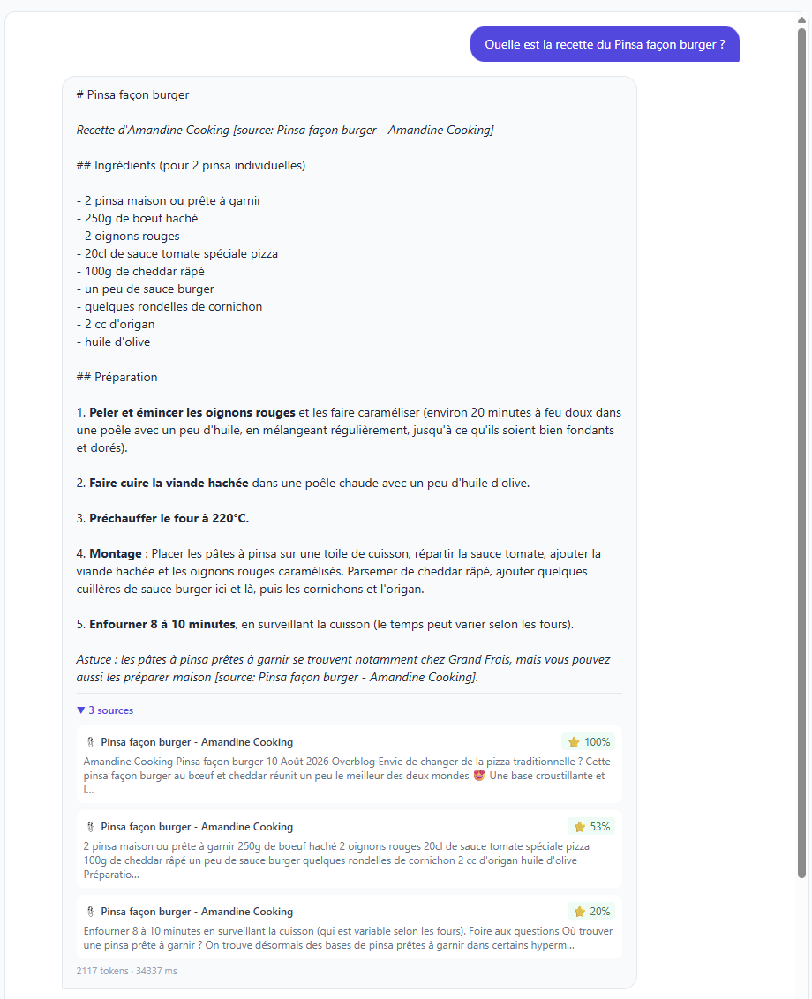
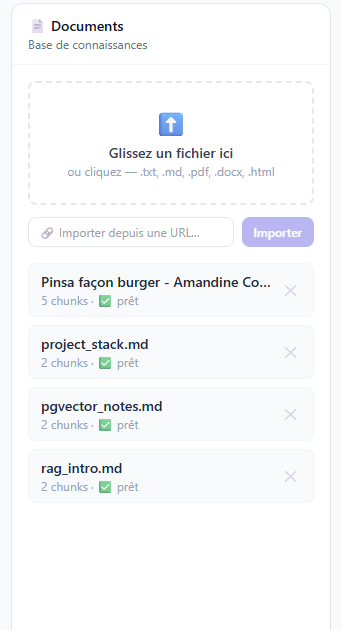
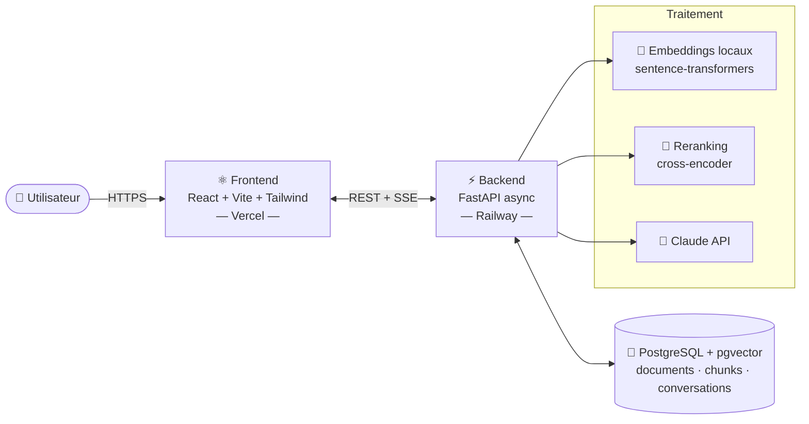
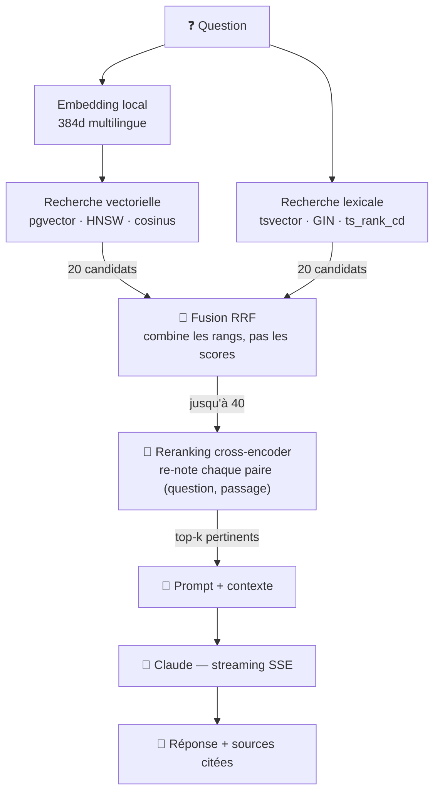

<div align="center">

# 🤖 RAG Chatbot — Questions-réponses sur vos documents

**Uploadez vos documents, posez des questions, obtenez des réponses ancrées dans vos sources** — avec citations, streaming en temps réel et reranking par cross-encoder.

[](https://github.com/mrSvet0zar/rag-application/actions/workflows/ci.yml)


### [🚀 Démo live](https://rag-application-flax.vercel.app) &nbsp;·&nbsp; [Fonctionnalités](#-fonctionnalités) &nbsp;·&nbsp; [Architecture](#-architecture) &nbsp;·&nbsp; [Démarrage](#-démarrage-rapide)

</div>

---

Un chatbot **Retrieval-Augmented Generation** de bout en bout, déployé et fonctionnel. Il démontre la maîtrise d'une chaîne RAG complète : chunking, embeddings vectoriels, recherche sémantique, **reranking**, et génération par LLM avec citation des sources.

> 💡 **Sans clé API ?** L'app tourne quand même : la recherche vectorielle fonctionne et une réponse est construite localement (*mode démo*). Ajoutez une clé Anthropic pour activer les réponses de Claude.

## 🖼️ Démo

<!-- Ajoutez vos captures dans docs/screenshots/ (voir la note en bas du README) -->
<div align="center">

| Chat avec sources & reranking | Panneau documents |
| :---: | :---: |
|  |  |

</div>

## ✨ Fonctionnalités

- 🔍 **Recherche hybride + reranking** — recherche vectorielle (pgvector, HNSW) **et** lexicale full-text, fusionnées par *Reciprocal Rank Fusion*, puis re-classées par un cross-encoder multilingue. Le vectoriel comprend la paraphrase, le lexical rattrape les sigles et noms propres qu'il rate.
- 🧠 **Génération Claude** avec **citation des sources** (`[source: fichier]`) et **streaming SSE** token par token.
- 🌍 **Embeddings 100 % locaux** (`sentence-transformers`, multilingue FR/EN, 384 dims) — gratuits, sans clé, sans coût.
- 📥 **Ingestion multi-formats** — `.txt`, `.md`, `.pdf`, `.docx`, `.html`, et **import depuis une URL** (avec garde **anti-SSRF**).
- 💬 **Conversations persistées** (documents, chunks, conversations, messages en base).
- 🌗 **Mode clair / sombre** persistant (respecte la préférence système, sans flash au chargement).
- 🛡️ **Robustesse** — schéma auto-appliqué au démarrage, retry de connexion, dégradation gracieuse si le LLM est indisponible, mode démo.
- ⚙️ **Prêt pour la prod** — Docker, CI GitHub Actions, déployé sur Railway + Vercel.

## 🏗️ Architecture



### Le flux d'une question



**Pourquoi ces trois étages ?** Un bi-encodeur (embeddings) encode la question et les passages *séparément* — rapide, mais aveugle aux termes exacts : le sigle *ACP* ou un titre anglais dans un texte français lui échappent. La recherche lexicale couvre exactement ce trou, et **RRF** fusionne les deux classements sans avoir à normaliser deux échelles de scores incomparables. Le cross-encoder, lui, lit la paire (question, passage) *ensemble* et corrige l'ordre. [Chiffres à l'appui](docs/EVALUATION.md).

## 🧱 Stack

| Couche       | Techno                                                                 |
| ------------ | ---------------------------------------------------------------------- |
| Frontend     | React 18 + Vite + Tailwind CSS + React Query                           |
| Backend      | FastAPI (async) + asyncpg                                              |
| Embeddings   | `sentence-transformers` (local, multilingue, 384 dims)                 |
| Recherche    | Hybride : pgvector (HNSW, cosinus) + full-text PostgreSQL, fusion RRF   |
| Reranking    | Cross-encoder `mmarco-mMiniLMv2` (multilingue)                         |
| LLM          | Anthropic **Claude** (`claude-sonnet-5`)                               |
| Vector store | PostgreSQL 16 + **pgvector** (index HNSW, similarité cosinus)          |
| Déploiement  | Railway (backend + DB) · Vercel (frontend) · Docker · GitHub Actions   |

## 🚀 Démarrage rapide

**Prérequis :** Docker, Python 3.10+, Node.js 18+.

```bash
# 1. Base de données (PostgreSQL + pgvector)
docker compose up -d

# 2. Backend
cd backend
python -m venv venv && source venv/bin/activate   # Windows: venv\Scripts\Activate.ps1
pip install -r requirements.txt
cp .env.example .env        # optionnel : renseignez ANTHROPIC_API_KEY
uvicorn app.main:app --reload --port 8000

# 3. Frontend (autre terminal)
cd frontend
npm install && npm run dev
```

- Interface : http://localhost:5173
- API + Swagger : http://localhost:8000/docs
- Charger les documents d'exemple : `cd backend && python -m scripts.seed_documents`

## 📡 API

| Méthode  | Route                        | Description                              |
| -------- | ---------------------------- | ---------------------------------------- |
| `POST`   | `/api/documents/upload`      | Upload (txt/md/pdf/docx/html) + index    |
| `POST`   | `/api/documents/import-url`  | Importe une page web (SSRF-guarded)      |
| `GET`    | `/api/documents`             | Liste des documents                      |
| `DELETE` | `/api/documents/{id}`        | Supprime un document et ses chunks       |
| `POST`   | `/api/chat`                  | Question (RAG, réponse complète)         |
| `POST`   | `/api/chat/stream`           | Question en **streaming** (SSE)          |
| `GET`    | `/api/conversations/{id}`    | Historique d'une conversation            |
| `GET`    | `/api/stats`                 | Statistiques globales                    |

## 📏 Évaluation de la recherche

La qualité de la récupération est **mesurée**, pas supposée : 27 articles épinglés
à une révision (1312 chunks), 31 questions annotées par extraits verbatim,
métriques déterministes et latences. Méthode, résultats et limites assumées :
**[docs/EVALUATION.md](docs/EVALUATION.md)**.

| Configuration | hit@5 | recall@5 | MRR | nDCG@5 | p50 |
|---|---|---|---|---|---|
| Vectoriel seul | 0.419 | 0.342 | 0.309 | 0.286 | 22 ms |
| Vectoriel + reranking | 0.581 | 0.454 | 0.524 | 0.443 | 577 ms |
| Hybride seul | 0.645 | 0.517 | 0.346 | 0.372 | 44 ms |
| **Hybride + reranking** | **0.774** | **0.664** | **0.664** | **0.614** | 1151 ms |

Les deux étages sont complémentaires : **l'hybride trouve** (à lui seul il bat
vectoriel+reranking sur `hit@5` pour 13× moins de latence), **le reranking
ordonne** (+ 0.32 de MRR). Ensemble : `hit@5` +85 %, MRR +115 %. Les 12 questions
à terme exact passent désormais toutes (`hit@5` = 1.000).

```bash
cd backend && python -m eval.runner --compare
```

## 🧪 Qualité

```bash
cd backend
pip install -r requirements-dev.txt

pytest                      # 206 tests (unitaires + intégration), gate de couverture à 80 %
pytest tests/unit           # sans base de données
ruff check . && ruff format --check .
mypy
```

Les tests d'intégration tournent sur une **vraie** base pgvector (créée à la volée,
tables vidées entre chaque test) et remplacent uniquement les modèles ML par des
doublures déterministes. Sans PostgreSQL joignable, ils sont ignorés proprement —
pointez-les ailleurs avec `TEST_DATABASE_URL`.

```bash
cd frontend && npm run lint && npm run format:check && npm run build
```

La CI rejoue tout (lint, types, tests + couverture, build front, build de l'image Docker).

## ⚙️ Configuration

Variables principales (`backend/.env`, voir [`.env.example`](backend/.env.example)) :

| Variable              | Défaut              | Rôle                                        |
| --------------------- | ------------------- | ------------------------------------------- |
| `ANTHROPIC_API_KEY`   | *(vide)*            | Clé Claude. Vide = mode démo.               |
| `CHAT_MODEL`          | `claude-sonnet-5`   | Modèle de génération                        |
| `RERANK_ENABLED`      | `true`              | Reranking cross-encoder (2ᵉ modèle, ~500 Mo RAM) |
| `MIN_RELEVANCE_SCORE` | `0.25`              | Seuil de similarité (sans rerank)           |
| `TOP_K_RETRIEVAL`     | `5`                 | Nombre de chunks fournis au LLM             |

## ☁️ Déploiement

Guide complet Railway + Vercel : **[DEPLOYMENT.md](DEPLOYMENT.md)**.
Fichiers fournis : `backend/Dockerfile`, `backend/railway.toml`, `frontend/vercel.json`, `.github/workflows/ci.yml`.

## 📁 Structure

```
rag-application/
├── docker-compose.yml          # PostgreSQL + pgvector
├── backend/
│   ├── app/
│   │   ├── main.py             # app factory + mapping erreurs -> HTTP
│   │   ├── services.py         # composition root (l'objet graphe câblé)
│   │   ├── deps.py             # providers d'injection FastAPI
│   │   ├── protocols.py        # interfaces (Embedder, Reranker, Generator…)
│   │   ├── api/                # routers (health, documents, chat, …)
│   │   ├── retrieval.py        # récupération à deux étages
│   │   ├── ingestor.py         # ingestion : chunks -> embeddings -> stockage
│   │   ├── generation.py       # génération Claude + repli démo/erreur
│   │   ├── chunking.py         # découpage du texte
│   │   ├── embeddings.py       # embeddings locaux
│   │   ├── reranker.py         # reranking cross-encoder
│   │   ├── ingestion.py        # extraction docx/html/pdf + garde anti-SSRF
│   │   ├── errors.py           # erreurs métier
│   │   └── vector_db.py        # accès DB async + recherche vectorielle
│   ├── eval/                # corpus épinglé, golden set, métriques, runner
│   ├── alembic/             # migrations de schéma
│   └── tests/
│       ├── doubles.py          # faux embedder/reranker/générateur
│       ├── unit/               # logique pure, sans I/O
│       └── integration/        # vraie PostgreSQL + API de bout en bout
└── frontend/
    └── src/
        ├── services/api.js
        ├── hooks/useTheme.js
        └── components/{Navbar,DocumentPanel,ChatInterface}.jsx
```

## 📄 Licence

[MIT](LICENSE) © Milan Ganivet

---

<div align="center">
<sub>Projet 1 d'un portfolio autour de l'IA, des LLMs et de la recherche sémantique.</sub>
</div>
